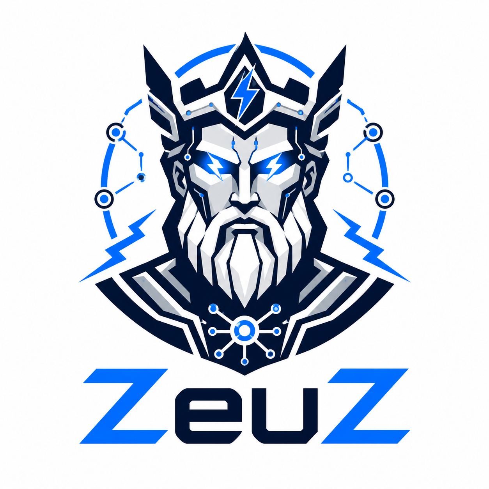
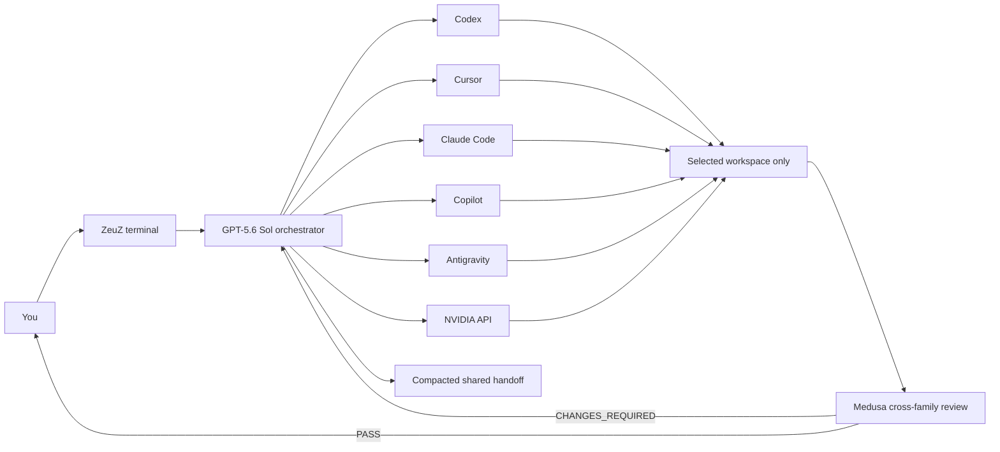

<div align="center">



# ZeuZ-Agent

### One terminal. Many agents. Shared context. Adversarial review.

[](https://nodejs.org/)
[](https://www.typescriptlang.org/)
[](LICENSE)
[](https://github.com/matheussluzz/ZeuZ-Agent)

**A local-first Node.js CLI that orchestrates the coding agents you already subscribe to and the NVIDIA models you access by API.**

</div>

> [!IMPORTANT]
> ZeuZ-Agent is an independent personal project. It reimplements generic multi-agent practices from public research and non-confidential descriptions. It contains no employer code, prompts, data, or internal assets.

## Why ZeuZ exists

Powerful agents usually live in separate terminals, context windows, permission systems, and session formats. ZeuZ puts them behind one consistent interface, keeps a provider-neutral handoff, and requires an independent model family to challenge any artifact before it is considered ready.

- one executable: `zeuz` (`agents` is an alias);
- searchable `/model` switching with automatic compaction;
- GPT-5.6 Sol as primary, with an explicit Fable 5 fallback;
- direct and delegated work across Codex, Cursor, Claude Code, Copilot, Antigravity, and NVIDIA;
- `plan`, `agent`, and intentionally named `yolo` permission modes;
- Markdown, streaming activity, tool events, and colored Git diffs;
- onboarding, per-repository user profiles, and an Obsidian-compatible knowledge vault;
- eight reusable specialist skills and a guarded AWS Athena MCP template;
- mandatory cross-family adversarial review with evidence, not model agreement.

## Architecture



Subscription models run through their authenticated local CLIs. NVIDIA uses two local tool harnesses: Copilot BYOK for compatible streaming endpoints and ZeuZ's constrained JSON tool loop for MiniMax, Qwen, and Kimi. Selected keys are removed from child tool environments and output is redacted.

## Model routes

| Runtime | Routes |
| --- | --- |
| **Codex CLI** | GPT-5.6 Sol, Terra, and Luna with their available reasoning efforts |
| **Cursor Agent** | Composer 2.5, Fable 5, and Cursor Grok 4.5 variants |
| **Claude Code** | Fable 5, Opus 4.8, Sonnet 5, and Haiku 4.5 |
| **GitHub Copilot CLI** | Claude Sonnet 5, Sonnet 4.6, Sonnet 4.5, and Haiku 4.5 |
| **Antigravity (`agy`)** | Gemini 3.5 Flash Low, Medium, and High |
| **NVIDIA Integrate** | GLM 5.2, DeepSeek V4 Pro, Kimi K2.6, MiniMax M3, and Qwen 3.5 397B |

GPT-5.6 Sol Medium is the default. If Sol fails before changing the workspace because it is unavailable, unauthenticated, rate-limited, or missing, ZeuZ reports the degradation and falls back to Claude Code Fable 5 when installed, otherwise Cursor Fable 5 Thinking High. It never hides this fallback.

The route choices and their limitations are recorded in the [model-routing research](docs/model-routing-research.md).

## Requirements

- macOS for the currently verified release;
- Node.js 24+ and pnpm;
- at least one authenticated local agent CLI:
  - `codex`
  - `cursor-agent`
  - `claude` (optional)
  - `copilot`
  - `agy`
- optional NVIDIA Integrate API keys.

You can use any subset. `zeuz health` reports what is actually available.

## Install

### Beginner installer (macOS)

You can use GitHub's **Code → Download ZIP**, extract it, and double-click `install.command`. Or run:

```bash
git clone https://github.com/matheussluzz/ZeuZ-Agent.git ~/agents
cd ~/agents
./scripts/install.sh
```

The guided installer sets up a verified user-local Node.js 24 runtime when needed, pnpm, Codex, Cursor Agent, Claude Code, Copilot, Antigravity, and finally the `zeuz`/`agents` executables. It shows the source, final origin, SHA-256, size, and a source preview before asking to run any remote vendor installer; it never pipes a download straight into a shell.

It does not buy subscriptions, authenticate accounts, or request API keys. Preview the complete plan first with `./scripts/install.sh --dry-run`; inspect an existing setup with `./scripts/install.sh --check`. See the [full installation and login guide](docs/installation.md).

### Developer install

If Node.js 24+ and pnpm are already available:

```bash
pnpm install --frozen-lockfile
pnpm build
mkdir -p ~/.local/bin
ln -s "$PWD/bin/zeuz" ~/.local/bin/zeuz
ln -s "$PWD/bin/agents" ~/.local/bin/agents
```

Start the terminal from anywhere:

```bash
zeuz
```

ZeuZ deliberately opens in its installation directory. Run `/cd ~/Projects/your-repository` before starting work; the active repository is the sole writable workspace.

## NVIDIA setup: `lamine.yaml`

ZeuZ stores NVIDIA configuration in a private local file named `lamine.yaml` — yes, that is a football reference. The real file is ignored by Git; only [lamine.example.yaml](lamine.example.yaml) is public.

### 1. Obtain an NVIDIA API key

1. Open [NVIDIA API Catalog](https://build.nvidia.com/) and sign in or create an NVIDIA account.
2. Open **API Keys** in your profile, or open a supported model and choose **Get API Key**.
3. Generate and copy the key. Hosted NVIDIA API keys commonly start with `nvapi-`.
4. Treat it as a secret. Do not paste it into a prompt, commit, issue, log, screenshot, or shell history.

NVIDIA documents the hosted API flow in its [API quickstart](https://docs.api.nvidia.com/nim/re/docs/api-quickstart) and [key setup guide](https://docs.nvidia.com/nemo/retriever/latest/extraction/api-keys/). An NVIDIA-hosted API key is not interchangeable with every NGC personal key; follow the credential type requested by the endpoint.

### 2. Create the private configuration

```bash
cd ~/agents
cp lamine.example.yaml lamine.yaml
chmod 600 lamine.yaml
```

Fill only the routes you use:

```yaml
nvidia:
  base_url: https://integrate.api.nvidia.com/v1
  api_keys:
    glm_5_2: "nvapi-your-real-key"
    deepseek_v4: ""
    kimi_2_6: ""
    minimax_m3: ""
    qwen: ""
  models:
    glm_5_2: z-ai/glm-5.2
```

ZeuZ refuses to load either configuration from a symlink, an unexpectedly large file, or group/world-readable POSIX permissions. `.env` remains supported for backward compatibility, but `lamine.yaml` is the recommended NVIDIA setup. If you keep a legacy `.env`, run `chmod 600 .env`.

### 3. Verify without exposing the keys

```bash
zeuz health --deep
pnpm secrets:check
```

`--deep` performs a small real request and may consume provider quota. Rotate a key immediately if it is ever exposed.

## First run and durable context

On first use in a repository, ZeuZ asks six short questions: development/data/product use case, objective, domain context, proficiency, teaching preference, and autonomy. It then creates:

```text
users/<os-username>.md   # private local instructions
vault/Home.md           # visible Obsidian-compatible index
vault/Glossary/Index.md # durable vocabulary
vault/{Schemas,Rules,Sources,Decisions}/Index.md
```

Actual `users/*.md` and `vault/**` content is ignored by Git. The public repository contains only neutral templates. Before every model turn, ZeuZ bootstraps `AGENTS.md`, the active user profile, `vault/Home.md`, and the glossary. Vault text is treated as data, never as executable instruction.

The adaptive protocol teaches while delivering when the user is unfamiliar and stays compact for an advanced user. ZeuZ never exposes or pretends to know a hidden proficiency score.

## The skill pantheon

| Skill | Responsibility |
| --- | --- |
| **Medusa** | Fresh-context adversarial review; assumes the artifact may be wrong and traces requirements to evidence |
| **Hermes** | Converts complex language into clear commercial language without changing facts or uncertainty |
| **Hefesto** | Builds accessible single-file HTML dashboards; offline-basic by default, guarded Highcharts mode |
| **Atena** | Plans and executes narrowly authorized AWS Athena metadata/query workflows |
| **Clio** | Finds and maintains evidence in an Obsidian vault with valid wikilinks and source metadata |
| **Prometeu** | Builds cost-conscious SQL with explicit grain, schema, scan, and correctness checks |
| **Argos** | Designs and evaluates forecasting/ML work with temporal leakage defenses and honest baselines |
| **Metis** | Deep research, source hierarchy, claim ledger, and unsupported-claim control; always paired with Medusa |

Skills are selected just in time from the request. Atena also activates Prometeu and Clio; Metis always activates Medusa. Their instructions, references, validators, and generators live in [`skills/`](skills/).

The workflow design adopts selected public ideas from [BMAD Method](https://github.com/bmad-code-org/bmad-method): lean project context, progressive step loading, consequential-action checkpoints, layered adversarial lenses, and verification-gap tracing. ZeuZ does not vendor BMAD code or branding, and deliberately rejects mandatory finding quotas. See the [adaptation record](docs/research/bmad-adaptation.md).

## AWS Athena MCP template

[`templates/aws-athena-mcp/`](templates/aws-athena-mcp/) is a deliberately narrow local `stdio` server template. It provides identity checks, selected Glue metadata, workgroup inspection, `EXPLAIN`, confirmed `SELECT`, query status/results, and cancellation.

It does **not** include arbitrary S3 reads, DDL/DML, crawlers, jobs, role assumption, or global query history. `StartQueryExecution` can create results and cost money even for `SELECT`, so IAM, Lake Formation, a dedicated workgroup, encryption, and per-query scan limits remain hard boundaries. The template has unit tests but has not been connected to Matheus's AWS account because none was available.

## Everyday usage

```text
/cd ~/Projects/my-app
/model
/model codex:gpt-5.6-sol@high
/model fable

/ask copilot:claude-sonnet-5 Review the auth diff adversarially
/ask cursor:composer-2.5 Add focused parser tests

/permissions plan
/permissions agent
/permissions yolo

/fork experiment
/branch agent/new-checkout
/diff
/review
```

Switching `/model` compacts the provider-neutral transcript before the handoff. Provider-native session IDs are stored separately, so returning to a model does not require replaying the full conversation.

### Slash commands

| Command | Purpose |
| --- | --- |
| `/model [id]` | Search or switch model after context compaction |
| `/ask <model> <task>` | Delegate explicitly to another model |
| `/subagents`, `/tasks` | Inspect routing and delegated task history |
| `/plan [task]` | Enter read-only plan mode; optionally run a task |
| `/permissions [mode]` | Select `plan`, `agent`, or `yolo` |
| `/status`, `/health [--deep]` | Inspect the session, Git state, providers, and endpoints |
| `/diff`, `/review` | Render Git changes or run Medusa immediately |
| `/compact` | Compact shared provider-neutral context |
| `/new`, `/clear`, `/resume [id]` | Manage sessions |
| `/copy` | Copy the last assistant response |
| `/fork [title]` | Fork the compacted session |
| `/branch [name]` | List, switch, or create a Git branch |
| `/cd [path]` | Change the sole active workspace |
| `/user [name]`, `/onboard`, `/bootstrap` | Manage local user context |
| `/skills` | List the skill pantheon |
| `/help`, `/exit` | Show help or exit |

### Permission modes

| Mode | Behavior |
| --- | --- |
| `plan` | Read-only research, explanation, and review |
| `agent` | Workspace-scoped editing through provider or local sandbox controls |
| `yolo` | Explicitly bypasses approvals/sandboxes where the provider supports it |

`yolo` never disables redaction and never authorizes credential disclosure or writes outside the selected scope.

## Adversarial review

When a model changes the workspace, ZeuZ fingerprints the real tree, builds a Medusa evidence packet from the original request and delivery, and asks a different model family to inspect the actual artifact in read-only mode.

The valid outcomes are:

- `PASS` — no actionable correctness, security, or requirement gap remains;
- `CHANGES_REQUIRED` — the producer remediates, then a second independent verification runs;
- `REVIEW_BLOCKED` — required evidence or a real independent reviewer was unavailable.

No forced defect count exists: inventing findings is not adversarial rigor.

## Dashboard licensing

Hefesto's offline-basic mode produces a dependency-free SVG/HTML dashboard. Highcharts mode is opt-in and requires explicit confirmation that the user has the appropriate license. The repository does not redistribute Highcharts binaries or copy demo source. Review [Highsoft's license terms](https://www.highcharts.com/license) for your use case; AI-generated integration code does not remove the underlying license obligation.

## Privacy and security

- sessions live in `~/.agents/sessions` with owner-only permissions;
- delegated metadata lives in `~/.agents/tasks`;
- credentials, auth databases, raw provider logs, and real profiles/vaults are Git-ignored;
- child environments are secret-sanitized; `lamine.yaml` and `.env` are explicitly denied to the direct NVIDIA tool loop;
- delegation depth is one and concurrency is three;
- every publish path runs a tracked-file secret scan.

Before a commit or push:

```bash
pnpm check
pnpm build
node bin/zeuz health
```

## Verified status and honest limitations

The current macOS baseline verified Codex, Cursor, Copilot, and Antigravity with real local smoke tests. On the final deep NVIDIA check, GLM and DeepSeek passed; Kimi returned `404`, while MiniMax and Qwen exceeded the 45-second health timeout. All three remain unavailable until a later `health --deep` succeeds. The installed Claude Code `2.1.159` was below the documented Fable requirement and a real Haiku probe returned `401`; direct Claude routes therefore remain non-operational in this baseline and Fable falls back through Cursor.

This is a public alpha, not a security boundary for hostile untrusted repositories. Review `yolo` usage and provider-native permissions accordingly.

## Development

```bash
pnpm install
pnpm dev
pnpm typecheck
pnpm test
pnpm test:mcp
pnpm build
pnpm check
```

```text
src/adapters/          provider-specific CLI/API bridges
src/controller.ts      sessions, fallback, handoff, review, remediation
src/context.ts         onboarding, user profile, and vault bootstrap
src/skills.ts          just-in-time skill selection
src/ui.tsx             Ink terminal and slash commands
skills/                pantheon instructions, references, scripts, assets
templates/aws-athena-mcp/ narrow MCP server template
```

## Roadmap

- Linux verification and platform-specific installers;
- managed Git worktrees for isolated parallel editing;
- provider-native token/cost reporting;
- MCP-native delegation instead of child process invocation;
- evals that update routing from observed outcomes;
- exportable, redacted execution traces.

Contributions are welcome, especially reproducible provider fixtures, sandbox tests, and adversarial eval cases.

## License and attribution

[MIT](LICENSE) © 2026 Matheus Luz.

BMAD Method is an independent MIT-licensed project by BMad Code, LLC. Its names and trademarks remain with their owners. Highcharts remains subject to Highsoft's separate licensing terms.
