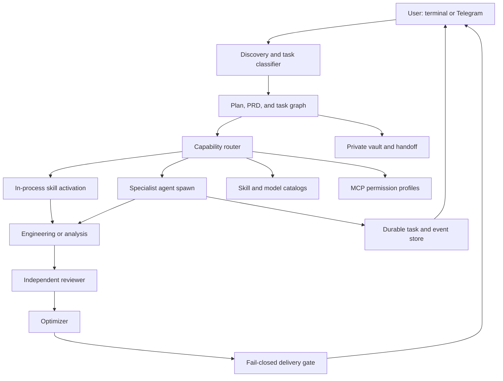

# ZeuZ-Agent Roadmap Candidate

Status: Wave 00 product contract frozen; implementation is ready to begin with Wave 01

Research cutoff: 2026-07-15

Current baseline: ZeuZ-Agent 0.1.0 at `82d3ca5`

Planning unit: one frontier-orchestrator session per wave

## Purpose

Evolve ZeuZ-Agent from a local multi-model terminal into a trustworthy, free, open-source agent orchestrator with:

- portable skills and spawnable specialist agents;
- automatic capability routing and explicit slash invocation;
- observable task, workflow, tool, and subagent state;
- adaptive discovery, PRD, architecture, engineering, review, and optimization stages;
- durable private user memory with provenance and user control;
- curated MCP integrations behind explicit trust boundaries;
- a secure Telegram remote channel while ZeuZ is running;
- reproducible global installation through `npm install -g zeuz`.

This document is the approved sequencing contract for development. Each implementation wave still requires its own bounded session, draft PR, deterministic evidence, and independent review before its outcome is accepted.

## Product principles

1. **Trust before autonomy.** A fallback, missing reviewer, unsupported permission mode, stale catalog, or unverifiable source is visible and cannot become a false success.
2. **Skills are capabilities; agents are workers.** Skills remain portable packages. ZeuZ spawns a specialist only when isolation, parallelism, provider specialization, or independent review adds value.
3. **Progressive context.** Discover skill metadata cheaply, load full instructions on activation, and load referenced resources only when needed.
4. **Adaptive discovery.** The amount of questioning follows ambiguity, consequence, reversibility, and the user's profile—not prompt length alone.
5. **Observable, not invasive.** Show safe reasoning summaries, plans, assumptions, decisions, tool activity, and task state. Never expose private chain-of-thought.
6. **Local-first privacy.** Profiles, vault notes, handoffs, credentials, sessions, raw provider events, and telemetry remain private and excluded from Git and npm artifacts.
7. **Discovery is not trust.** Popularity lists can identify candidates, but only provenance, permissions, sandboxing, and review can authorize a skill or MCP.
8. **One wave, one bounded outcome.** Every wave has a narrow artifact set, deterministic acceptance criteria, a rollback boundary, and independent cross-family review.

## Architecture decision checkpoint

Matheus froze decisions D01–D12 on 2026-07-15. Exact runtime details may be refined inside their owning wave, but no architecture-changing question remains open.

| ID | Status | Decision | Frozen policy | Why it is material |
| --- | --- | --- | --- | --- |
| D01 | FROZEN | Relationship between skills and subagents | Pantheon entries become specialist personas that compose BMAD, NVIDIA, and ZeuZ capability skills. Only the root ZeuZ orchestrator may spawn personas; personas may request another capability from the root, which may spawn a sibling. Persona-to-persona spawning is forbidden and delegation depth remains one. | ZeuZ remains the maestro that owns decomposition and synthesis while specialists stay bounded, observable, and context-efficient |
| D02 | FROZEN | Third-party skill acquisition | Import and adapt the complete BMAD and NVIDIA catalogs from pinned revisions with licenses, notices, attribution, modification history, provenance, trademark boundaries, validation, reviewed sync diffs, and free split bundles when core package budgets require them | Wholesale local availability serves ZeuZ's broad capability goal, but hundreds of changing files require automated trust and update controls |
| D03 | FROZEN | Slash command promise | Only Pantheon personas receive top-level persona commands such as `/argos`. Typing `/skill` opens the searchable full catalog; selecting or entering `/skill <id>` invokes a non-Pantheon skill. Non-Pantheon skills never receive top-level aliases. Built-in operational commands such as `/model`, `/status`, and `/skill` remain available. | This preserves fast persona access without flooding autocomplete with hundreds of commands or hiding terminal controls |
| D04 | FROZEN | Per-user model and cost policy | Sol is the default primary orchestrator and Fable the explicit fallback, but every interactive ZeuZ launch exposes a model selector and an explicit user choice becomes the orchestrator for that session. Non-interactive launch accepts `--model`; `/model` may switch between turns after provider-neutral compaction. Matheus's automatic order for bounded delegates is healthy GLM first, then the three Cursor routes, then Agy. | A user must be able to continue when one provider's tokens or quota end without silently changing the chosen session model or weakening health, cost, permission, and reviewer-family constraints |
| D05 | FROZEN | Discovery default | Use an autonomous fast path with explicit assumptions, a coaching path on request, and mandatory questions only for material ambiguity or consequential actions | This resolves material doubt without holding reversible work hostage |
| D06 | FROZEN | Five-stage workflow trigger | Require Brainstorming > Architecture > Engineering > Reviewer > Optimizer for substantial work; use abbreviated stages for trivial, localized, reversible tasks | Applying a full PRD to every tiny fix adds ceremony without reducing risk |
| D07 | FROZEN | Human checkpoints | Require approval for architecture-changing choices, paid/external consequences, secrets, destructive actions, publication, or unresolved material ambiguity; otherwise continue autonomously | Approval protects consequence without becoming routine friction |
| D08 | FROZEN | Visible thinking and messaging | Show safe summaries and structured events; make running subagents observable, expandable, and selectable in the terminal; support universal queued follow-ups plus native live input where safely supported | Raw chain-of-thought is not an acceptable contract, but users still need control and evidence of ongoing work |
| D09 | FROZEN | Vault memory | Auto-store durable preferences, definitions, decisions, and approved facts with provenance, sensitivity, confidence, freshness, deduplication, and inspect/edit/delete commands; encryption may follow local permission hardening rather than block the MVP | “Store everything” creates privacy, staleness, prompt-injection, and context-quality risks |
| D10 | FROZEN | Integration and MCP catalog | Prioritize Gmail, Google Drive, Chrome/browser, Telegram, and GitHub; retain the user-provided community directories as additional installable discovery sources; enable nothing silently. Use the safest supported native connector, dedicated transport, local adapter, or MCP for each integration and expose the transport type and authority through one catalog. | A unified experience should not erase authentication, lifecycle, permission, or trust differences between transports |
| D11 | FROZEN | Telegram MVP | Single-user allowlisted TypeScript long polling while the terminal is open, with durable offsets/idempotency and the authority matrix below. Read/status and isolated inert drafts may proceed without confirmation. An explicit Telegram implementation request may prepare changes only in a separate branch/worktree; key diffs require approval before commit and are never merged automatically. | Remote ideation and implementation remain useful while consequential changes cannot quietly affect the active workspace |
| D12 | FROZEN | Delivery cadence and package ownership | One draft PR per wave. The public unscoped `zeuz` package will be owned by Matheus's personal npm account; the exact registry username and package availability are verified in Wave 14. Publication waits for all release gates and explicit owner approval. | Small PRs preserve review quality and rollback; separating ownership from publication prevents the roadmap from being mistaken for release authorization |

### Telegram remote authority matrix

| Request class | Default handling | Confirmation boundary |
| --- | --- | --- |
| Read, status, health, task observation, and brainstorming chat | Run remotely | No confirmation when no artifact or external state changes |
| Brainstorm, PRD, or note draft | Write only to a private, isolated, non-executable draft inbox with provenance and a pending-acceptance state | No confirmation until promotion into the workspace or vault |
| Implementation explicitly requested through Telegram | Prepare new or modified artifacts only in a dedicated branch/worktree; show scope and group the important diffs into approve/reject checkpoints | Explicit inline Telegram approval before commit; rejected chunks are discarded or retained only as pending drafts |
| Merge/rebase into the active user branch, overwrite/delete, execute a migration, enable or execute a workflow/hook/config/script, access credentials, incur paid external effects, or publish | Block by default | Local terminal confirmation; never merge, execute, or publish automatically from Telegram |

“New file” is not itself a safe category. A new workflow, manifest, hook, migration, executable, symlink, credential file, or auto-loaded configuration may be drafted only in isolation and becomes consequential before activation, execution, or promotion.

## Verified baseline gaps

- `src/skills.ts` uses hard-coded regex activation and dependencies, injects full `SKILL.md` content, and silently truncates the result to three selected skills.
- `zeuz delegate` blocks until the provider finishes. Task state has no dependency graph, retry policy, cancellation API, message channel, heartbeat, artifact list, or full-result retrieval in the terminal.
- `src/ui.tsx` has slash commands but no dropdown while typing `/`, one flat activity line instead of a workflow tree, and no interactive input while a turn is busy.
- Runtime review uses a lighter contract than the Medusa evidence-packet lifecycle and can deliver producer output after unresolved review findings.
- Provider permission behavior is encoded independently across adapters without one conformance suite.
- Health is mostly installation/version-aware; only NVIDIA currently has model-level deep probes.
- Context compaction, vault loading, state schemas, subprocess buffering, non-Git change detection, task locking, and several adapters have known evidence or test gaps represented below.

## Target runtime model

### Capability package

Use the Agent Skills directory model: `SKILL.md` metadata plus optional `scripts/`, `references/`, and `assets/`. ZeuZ adds runtime metadata only where the portable standard does not cover orchestration:

- canonical ID, source, pinned revision, integrity, license, and trust state;
- triggers, capability tags, dependencies, conflicts, and context budget;
- preferred provider capabilities and fallback policy;
- allowed tools, network policy, secret policy, and writable boundary;
- explicit slash exposure and alias collision rules;
- whether activation is in-process, specialist-eligible, or specialist-required;
- required reviewer family and validation commands.

### Specialist agent profile

A Pantheon persona is a provider-neutral specialist-agent profile, not a renamed capability skill. It declares a purpose, one or more composable BMAD/NVIDIA/ZeuZ skills, model capability requirements, context budget, permissions, lifecycle, task ownership, and reviewer separation. Argos, Hefesto, Metis, Medusa, Clio, Prometeu, Atena, and Hermes become the first built-in personas.

Examples:

- forecasting or ML intent activates Argos;
- dashboard intent activates Hefesto after data reconciliation;
- deep current research activates Metis and an independent Medusa reviewer;
- Athena work activates Atena with Prometeu and Clio dependencies;
- plain/commercial translation activates Hermes.

The router must report why a skill was activated, why a persona was spawned, which model was selected, and any degraded fallback. The root orchestrator owns decomposition, persona spawning, sibling requests, consolidation, and final verification; personas never recursively spawn personas.

### Terminal event contract

Provider adapters emit provider-neutral structured events instead of UI-ready text:

- `turn.started|completed|failed|cancelled`;
- `session.model_selection_opened|selected|switched`;
- `plan.created|updated` and `task.queued|running|blocked|completed|failed`;
- `agent.spawned|status|message|result|cancelled`;
- `skill.discovered|activated|blocked`;
- `tool.started|progress|completed|failed`;
- `decision`, `assumption`, `safe_reasoning_summary`, `warning`, and `review.verdict`;
- bounded `output.delta` and artifact references.

The UI renders a collapsible tree, command palette, persistent checklist, direct-message/follow-up composer, safe progress pane, cancellation, and narrow/colorless accessible fallbacks. It never renders hidden provider reasoning.

## Existing candidate disposition

No original candidate is rejected outright. Several are merged, split, or absorbed so implementation does not create duplicate foundations.

| # | Disposition | Destination | Rationale |
| --- | --- | --- | --- |
| 1 | MERGE | Wave 02 | Combine the complete Medusa packet lifecycle with the fail-closed delivery gate |
| 2 | MERGE | Wave 02 | Same trust invariant as #1; reviewer failure must become `REVIEW_BLOCKED` |
| 3 | MERGE | Wave 02 | One adapter permission contract must cover new and resumed sessions |
| 4 | MERGE | Wave 02 | Direct NVIDIA command security is a required implementation of the shared permission contract |
| 5 | MERGE | Wave 02 | Parent epic for permission capability descriptors and conformance |
| 6 | KEEP | Wave 01 | Deterministic controller seams are prerequisite to every runtime wave |
| 7 | KEEP | Wave 03 | Non-Git workspaces need an honest change state before automatic review |
| 8 | SPLIT | Waves 03, 04, and 07 | Runtime abort/deadline behavior first; durable cancellation state and terminal interaction follow |
| 9 | KEEP | Wave 03 | Bounded streaming is foundational for long turns and visible progress |
| 10 | MERGE | Wave 04 | Versioned state is part of the durable task/session engine |
| 11 | MERGE | Wave 04 | Atomic writes, ownership, heartbeat, and lock reclamation belong together |
| 12 | SPLIT | Waves 04 and 06 | Durable async engine first; specialist lifecycle and messaging second |
| 13 | KEEP | Wave 01 | Adapter fixtures and opt-in real smokes protect provider-neutral behavior |
| 14 | KEEP | Wave 10 | Layered health is an input to routing, not a version-only badge |
| 15 | KEEP | Wave 10 | Catalog provenance and freshness prevent silent route drift |
| 16 | KEEP | Wave 10 | Local outcome telemetry enables evidence-based routing and retention controls |
| 17 | MERGE | Wave 09 | Structured compaction and durable memory share provenance and budget requirements |
| 18 | SPLIT | Waves 05 and 06 | Separate portable catalog/routing from specialist spawn/lifecycle behavior |
| 19 | MERGE | Wave 09 | Typed trust blocks and context budgets are required by memory and compaction |
| 20 | SPLIT | Waves 02, 09, 11, 12, and 14 | State-root and secret baseline first; apply it to memory, MCP, Telegram, and packages |
| 21 | KEEP | Wave 04 | Worktree/branch safety is required before parallel editing tasks |
| 22 | SPLIT | Waves 01 and 07 | Extract testable command state first; deliver the full interactive experience later |
| 23 | KEEP | Wave 14 | Cross-platform packed-artifact and supply-chain verification gates npm release |
| 24 | ABSORB | Waves 01–14 | No standalone broad rewrite; extract policy modules only behind characterization tests |
| 25 | KEEP | Wave 14 | Generate volatile command/route/health documentation from runtime evidence |

## New requirement map

| ID | Requirement | Waves |
| --- | --- | --- |
| N01 | Pantheon specialist agents, large BMAD/NVIDIA skill ecosystem, automatic routing, explicit invocation, and slash discoverability | 05–06 |
| N02 | Slash dropdown, workflow tree, direct subagent follow-up, visible safe progress, and mandatory task lists for substantial requests | 04, 06–07 |
| N03 | Adaptive onboarding and long-request brainstorming plus PRD and the five-stage delivery pipeline | 08 |
| N04 | Durable personal vault, terminology, preferences, decisions, freshness, and no needless repeat questions | 09 |
| N05 | Curated MCP ecosystem from official and community discovery sources | 11 |
| N06 | Telegram remote channel informed by the Lumen prototype but redesigned for security and reliability | 12 |
| N07 | Review and disposition of all 25 original candidates | 00 |
| N08 | Forever free/open source and eventual `npm install -g zeuz` distribution | 13–14 |

## Wave plan

### Wave 00 — Product contract and roadmap freeze

**Outcome:** turn this discussion draft into an approved development contract.

**Scope:** decisions D01–D12; complete original-candidate disposition; wave boundaries; dependency graph; measurable acceptance criteria; rollback and review plan; source/license ledger.

**Exit criteria:** no unresolved architecture-changing question; every original and new requirement maps to a wave; independent research/source replay and roadmap review pass; the draft PR contains only public contract, roadmap, and supporting research artifacts.

**Rollback:** documentation-only revert.

### Wave 01 — Deterministic orchestration and adapter test foundation

**Outcome:** make controller, adapters, command dispatch, clocks, IDs, fingerprints, and stores testable without launching real providers or Ink.

**Scope:** candidates 6, 13, enabling slice of 22, and only the characterization/extraction work needed from 24.

**Exit criteria:** deterministic default-primary, explicit session-selection, fallback, review, and persistence tests; sanitized fixtures for every adapter; command parser success/failure coverage; opt-in real smokes are clearly separate from CI proof; a failed turn that may have changed the workspace is never silently replayed through another model.

**Rollback:** keep compatibility wrappers around existing concrete construction until later waves migrate.

### Wave 02 — Fail-closed trust, review, permissions, and secret boundary

**Outcome:** one enforceable trust contract across producers, reviewers, adapters, local commands, and state roots.

**Scope:** candidates 1–5 and the foundational state/secret portion of 20.

**Exit criteria:** validated Medusa packet/report lifecycle; only a fresh cross-family `PASS` can complete changed artifacts; identical plan/agent/yolo semantics or named hard failure across adapters; resume transitions covered; shell chaining, substitutions, redirects, symlinks, credential filenames, unsafe state modes, and tracked-secret conditions tested without live secrets.

**Rollback:** feature flag the new review driver while preserving fail-closed behavior.

### Wave 03 — Process resilience and observable streaming

**Outcome:** long provider turns remain bounded, cancellable, diagnosable, and honest in Git and non-Git workspaces.

**Scope:** candidates 7–9 and controller-side portion of 8.

**Exit criteria:** turn/review/remediation deadlines; interrupt-to-kill escalation; bounded byte buffers and incremental parsing; redacted truncation diagnostics; honest `changed|unchanged|unmeasurable`; cancellation leaves resumable state.

**Rollback:** retain the existing runner behind the new interface for one release.

### Wave 04 — Versioned durable task engine and editing isolation

**Outcome:** replace synchronous delegation records with durable asynchronous tasks and safe ownership.

**Scope:** candidates 8 and 10–12 runtime foundation, plus candidate 21.

**Exit criteria:** versioned schemas/migrations/quarantine; unique atomic writes; heartbeat and live-owner lock recovery; queued/running/blocked/completed/failed/cancelled state; dependencies, bounded retry, artifacts, full result retrieval, parent-child correlation; three parallel read-only tasks; overlapping editing tasks require separate worktrees or serialize; dirty/diverged branch preflight.

**Rollback:** migrate from current records with a backup and retain a read-only legacy importer.

### Wave 05 — Portable skill registry and provenance

**Outcome:** scale beyond hard-coded pantheon regexes without loading the catalog into context.

**Scope:** first half of candidate 18 and N01 catalog concerns.

**Exit criteria:** Agent Skills-compatible discovery; complete pinned BMAD and NVIDIA catalog imports; a reproducible sync tool that emits source revision, file inventory, applicable license/attribution, required Apache `NOTICE` material, prior and ZeuZ modification records, file-level overrides, integrity data, and a human-reviewable diff; downstream distribution adds no terms that restrict licensed reuse; validation of metadata, dependencies, conflicts, context budgets, allowed tools, scripts, network behavior, integrity, source revision, license, and trust state; deterministic routing reasons; install/update/remove controls; imported skills disabled or quarantined until validation; package-size and startup budgets with separately versioned free catalog bundles if the core npm artifact would become excessive; no silent dependency truncation.

**Rollback:** built-in pantheon packages remain available from a reviewed local catalog snapshot.

### Wave 06 — Specialist agent lifecycle and command surface

**Outcome:** make pantheon and installed capabilities spawnable, observable, and explicitly controllable.

**Scope:** second half of candidate 18, task-engine integration from 12, and N01/N02 specialist behavior.

**Exit criteria:** in-process versus spawn policy; built-in Pantheon personas; automatic intent routing; top-level persona slash commands only for Pantheon personas; `/skill` opens a searchable list of the complete non-Pantheon catalog and `/skill <id>` invokes the selection; no non-Pantheon top-level aliases; only the root orchestrator spawns personas and a persona capability request is routed back to the root for an optional sibling spawn; dependency activation; cross-family reviewer separation; queued follow-up messaging and provider-native live input only when supported; cancellation and result retrieval.

**Rollback:** disable specialist spawning while preserving in-process skill activation.

### Wave 07 — Interactive terminal experience

**Outcome:** expose ZeuZ's real work as an accessible, low-noise terminal workflow.

**Scope:** candidates 8 and 22 delivery slices, plus N02 UI.

**Exit criteria:** slash dropdown on `/`; fuzzy search and keyboard navigation; interactive startup model selector with the configured default highlighted plus configuration, health, cost/quota, and fallback labels; `--model` for non-interactive startup and `/model` for between-turn switching after provider-neutral compaction; persistent task checklist for substantial requests; collapsible, observable, and selectable workflow/subagent rows with status, model, elapsed time, tools, artifacts, result, and message composer; safe reasoning/activity timeline; cancellation; narrow terminal, no-color, screen-reader-friendly text fallback; Ink and spawned CLI E2E tests.

**Rollback:** preserve non-interactive commands and a compact legacy renderer.

### Wave 08 — Adaptive discovery, PRD, and five-stage workflow

**Outcome:** make requirements clear before consequential work without forcing ceremony on trivial tasks.

**Scope:** N03 and onboarding refinement.

**Exit criteria:** user-profile-aware fast/coaching/ideate-for-me stances; ambiguity and consequence classifier; structured PRD with requirements, non-goals, assumptions, decisions, acceptance criteria, risks, and test plan; full Brainstorming > Architecture > Engineering > Reviewer > Optimizer task graph for substantial work; pause only on material decisions; optimizer changes trigger fresh review.

**Rollback:** explicit command to use the legacy direct-turn path for safe trivial work.

### Wave 09 — Structured context, compaction, and personal memory

**Outcome:** preserve durable user knowledge and continuity without turning the vault into an untrusted transcript dump.

**Scope:** candidates 17, 19, memory portion of 20, and N04.

**Exit criteria:** typed context blocks with origin/trust/sensitivity/freshness; mandatory instruction budgets; structured compaction preserving requirements, decisions, files, checks, uncertainty, and review findings; memory proposal/dedup/conflict/staleness policy; `/remember`, `/memory`, `/forget`, and `/vault`; user inspection/edit/delete/export; no credentials; no repeated question when current authoritative memory answers it; stale/conflicting/high-risk facts trigger confirmation.

**Rollback:** memory can be disabled and private notes exported before removal.

### Wave 10 — Health-aware routing, catalogs, and local telemetry

**Outcome:** route by observed capability and task outcome rather than static labels or price alone.

**Scope:** candidates 14–16 and D04.

**Exit criteria:** installation/authentication/model/tool/permission/latency health layers with timestamps; onboarding/discovery captures each user's provider access, unlimited/paid status, route preferences, and per-session paid budget; Sol/Fable remain Matheus's default primary/fallback while his bounded delegates prefer healthy GLM, then the three Cursor routes, then Agy; an explicit startup model selection overrides the default only for that session; opt-in quota probes; pinned catalog refresh with provenance and reviewed fallback; unavailable routes disabled without changing defaults silently; redacted local token/latency/failure/fallback/review/outcome metrics; hard stop or confirmation before exceeding budget; retention and reset controls; no prompt content; route explanation names cost/health/capability/reviewer constraints.

**Rollback:** reviewed static catalog remains available when discovery is offline.

### Wave 11 — Curated MCP platform

**Outcome:** make external tools discoverable and useful without silently expanding authority.

**Scope:** N05 and MCP-specific portion of 20.

**Exit criteria:** official registry/vendor ingestion; initial integration profiles for Gmail, Google Drive, Chrome/browser, Telegram, and GitHub; selection of a native connector, dedicated transport, local adapter, or MCP from explicit security/lifecycle criteria; the user-provided MCP directories remain searchable additional install sources and are labeled discovery-only; capability, provenance, transport, and authority cards; explicit install/enable confirmation; permission scopes, environment allowlists, network/filesystem policy, sandbox mode, and audit events; health and version checks; disabled-by-default third-party servers; malicious/compromised fixture tests.

**Rollback:** one command disables a server/profile and removes its runtime authorization without deleting user data.

### Wave 12 — Telegram remote channel

**Outcome:** securely submit and observe ZeuZ work from Telegram while the local terminal owns execution.

**Scope:** N06 and the Telegram-specific portion of candidate 20, reusing only behavioral lessons from Matheus's private Lumen prototype rather than copying its implementation or local paths into public artifacts.

**Exit criteria:** provider-neutral remote transport interface; single-user pairing and user/chat allowlists; portable TypeScript `getUpdates` long polling with positive timeout, exponential backoff, durable offset, idempotency, rate limits, atomic state, and safe shutdown; redacted audit; status, prompt submission, approve/reject, cancel, and task/agent follow-up commands; private inert draft inbox with provenance, pending acceptance, and no executable/autoload paths; an explicit implementation intent that cannot be inferred from brainstorming; branch/worktree isolation for remote implementation; logical diff summaries with explicit Telegram approve/reject checkpoints before commit; no automatic merge; local-terminal gates for active-branch integration and consequential actions in the D11 matrix; the bot token loads from the OS keychain when supported, with a Git-ignored mode-`0600` local configuration or sanitized environment fallback; no raw messages or tokens in logs, vault, prompts, or task records.

**Rollback:** remote transport can be disabled and revoked locally without affecting terminal sessions.

### Wave 13 — Open-source contributor and extension experience

**Outcome:** let contributors add providers, skills, specialists, MCP profiles, transports, and UI components safely.

**Scope:** N08 contributor-facing prerequisites before public release.

**Exit criteria:** stable extension interfaces; examples and templates; contribution/security/support policies; complete third-party license, attribution, source-revision, and modification inventory; clear documentation that identifies imported BMAD and NVIDIA skills without implying endorsement or using their marks as ZeuZ branding; skill and MCP validation commands; architecture decision records; no private artifact in source or package.

**Rollback:** experimental APIs remain explicitly versioned and can be disabled before 1.0.

### Wave 14 — Packed release, generated documentation, and npm publication

**Outcome:** prove the consumer artifact, then publish the free public `zeuz` package with explicit owner approval.

**Scope:** candidates 23, 25, release portion of 20, and N08.

**Exit criteria:** availability of the unscoped `zeuz` name and Matheus's exact personal npm username confirmed without publishing; ownership and 2FA/account policy recorded; `npm pack` content allowlist and secret scan; isolated global install smoke for `zeuz version`, `help`, and safe `health`; supported OS/Node/pnpm matrix; pinned CI actions; SBOM and provenance; OIDC trusted publishing; rollback/deprecation procedure; generated command/route/sanitized-health docs with timestamps; explicit human approval before first publication.

**Rollback:** deprecate or unpublish only within npm policy; keep a tested previous version and documented recovery path.

## Model and delegation policy for implementation waves

- GPT-5.6 Sol is the default orchestrator for ambiguous, cross-cutting waves and Fable is the explicit fallback; the user may select any healthy configured session orchestrator at startup.
- For Matheus, healthy GLM is the first bounded-delegate choice, followed by the three Cursor routes and then Agy; other users receive their own onboarding policy.
- Route health is checked before delegation. A shallow health pass is not proof that a long task will finish.
- Paid frontier routes are used according to D04, especially when unlimited routes fail, a task needs stronger reasoning, or independent reviewer-family separation requires it.
- Maximum delegation depth remains one and concurrency remains three.
- Two editing agents never touch the same files concurrently; worktrees or serialization are mandatory.
- The primary agent independently inspects all delegate output and owns integration and verification.
- Every delivered artifact receives fresh-context adversarial review from a different model family. Missing independent review is `REVIEW_BLOCKED`, never `PASS`.

## Definition of done for every implementation wave

1. The wave starts from an approved scope, explicit non-goals, acceptance criteria, risk list, and rollback boundary.
2. A mandatory task list is visible and kept current for the full wave.
3. Relevant provider health is observed before delegation and degraded routes are named.
4. Unrelated user changes are preserved; secret files and private state never enter prompts, diffs, logs, commits, or packages.
5. New slash commands include help, public documentation, non-UI tests, autocomplete metadata, and failure behavior.
6. State or protocol changes include migration, corruption, cancellation, concurrency, and rollback tests.
7. The primary agent runs proportional checks plus `pnpm check`, `pnpm build`, and `node bin/zeuz health` before claiming completion.
8. Provider/orchestration changes include opt-in real smoke evidence when safe; quota/auth/endpoint failures remain explicit.
9. A different model family reviews request, artifact, diff, tests, edge paths, security, portability, and delivery claims.
10. `CHANGES_REQUIRED` is remediated and independently re-reviewed. `REVIEW_BLOCKED` blocks completion.
11. Durable approved decisions update the private vault; the compact private `handoff.md` is rewritten before delivery.
12. The wave uses its own draft PR and intentional commits after `pnpm secrets:check`.

## Sources and adaptation boundaries

- Agent Skills packaging and progressive disclosure: <https://agentskills.io/specification>
- NVIDIA Agent Skills catalog and tooling: <https://github.com/NVIDIA/skills>
- BMAD brainstorming skill and current PRD workflow: <https://github.com/bmad-code-org/BMAD-METHOD/blob/main/src/core-skills/bmad-brainstorming/SKILL.md>, <https://github.com/bmad-code-org/BMAD-METHOD/blob/main/src/bmm-skills/2-plan-workflows/bmad-prd/SKILL.md>
- BMAD MIT license and trademark notice: <https://github.com/bmad-code-org/BMAD-METHOD/blob/main/LICENSE>, <https://github.com/bmad-code-org/BMAD-METHOD/blob/main/TRADEMARK.md>
- NVIDIA Apache 2.0 / CC BY 4.0 license: <https://github.com/NVIDIA/skills/blob/main/LICENSE>
- Skills versus isolated subagents: <https://code.claude.com/docs/en/features-overview>
- Subagent lifecycle concepts: <https://code.claude.com/docs/en/agents>
- Terminal skill/subagent/task command precedents: <https://docs.github.com/en/copilot/reference/copilot-cli-reference/cli-command-reference>
- MCP security guidance and official registry: <https://modelcontextprotocol.io/docs/tutorials/security/security_best_practices>, <https://github.com/modelcontextprotocol/registry>
- Telegram Bot API long polling: <https://core.telegram.org/bots/api#getupdates>
- npm unscoped public packages and trusted publishing: <https://docs.npmjs.com/creating-and-publishing-unscoped-public-packages/>, <https://docs.npmjs.com/trusted-publishers/>

ZeuZ may copy and adapt the complete public BMAD and NVIDIA skill catalogs under their applicable licenses. Every imported copy must preserve required licenses, applicable Apache `NOTICE` material, and attribution; identify its pinned source, prior modifications, and ZeuZ modifications; respect trademark boundaries; avoid implying upstream endorsement; and add no downstream restriction to licensed reuse. Third-party instructions remain untrusted data until provenance, license, integrity, manifest, dependency, script, tool, network, secret, and permission validation establishes an explicit trust state.

## Wave 00 freeze record

- Primary defaults: Sol, then Fable; explicit startup selection controls the current session; Matheus's GLM > Cursor > Agy order applies to bounded delegates.
- Orchestration: only root ZeuZ spawns sibling Pantheon personas and consolidates their results; personas compose skills and never spawn personas.
- Telegram: observation and inert isolated drafts are autonomous; mutation requires approval and isolation; active-branch integration and consequential actions require local confirmation.
- Integrations: one catalog may select native connectors, dedicated transports, local adapters, or MCPs while exposing the transport and authority boundary.
- npm: the intended owner is Matheus's personal npm account; exact username, name availability, and publication approval remain Wave 14 release checks rather than open architecture questions.
